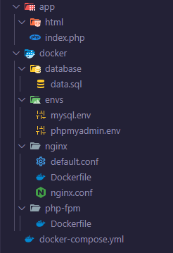

# Configuração de ambiente de desenvolvimento com Nginx, PHP-FPM, MySQL e PHPMyAdmin
- Estrutura das pastas


- Docker compose file
```docker
services:
  nginx:
    build:
      context: ./docker/nginx
    container_name: nginx
    restart: always
    volumes:
     - ./app:/var/www
    depends_on:
      - php-fpm
      - database
    ports:
     - 80:80
    networks:
     - php-stack
  
  php-fpm:
    build:
      context: ./docker/php-fpm
    container_name: php-fpm
    restart: always
    volumes:
      - ./app:/var/www
    depends_on:
      - database
    networks:
      - php-stack
  
  phpmyadmin:
    image: phpmyadmin:latest
    container_name: phpmyadmin
    restart: always
    env_file:
      - ./docker/envs/phpmyadmin.env
    ports:
      - 8081:80
    depends_on:
      - database
    networks:
      - php-stack

  database:
    image: mariadb:latest
    container_name: database
    restart: always
    env_file:
     - ./docker/envs/mysql.env
    ports:
      - 8080:3306
    volumes:
      - ./docker/database/data.sql:docker-entrypoint-initdb.d/data.sql
    networks:
      - php-stack

networks:
  php-stack:
    name: php-stack

```

## Nginx folder
- Dockerfile
```docker
FROM nginx:alpine
ADD nginx.conf /etc/nginx/nginx.conf
ADD default.conf /etc/nginx/conf.d/default.conf
```
- default.conf
```docker
upstream php-upstream {
    server php-fpm:9000;
}

server {

    listen 80 default_server;
    listen [::]:80 default_server ipv6only=on;

    server_name localhost;
    root /var/www;
    index index.php index.html index.htm;

    location / {
         try_files $uri $uri/ /index.php$is_args$args;
    }

    location ~ \.php$ {
        try_files $uri /index.php =404;
        fastcgi_pass php-upstream;
        fastcgi_index index.php;
        fastcgi_buffers 16 16k;
        fastcgi_buffer_size 32k;
        fastcgi_param SCRIPT_FILENAME $document_root$fastcgi_script_name;
        #fixes timeouts
        fastcgi_read_timeout 600;
        include fastcgi_params;
    }

    location ~ /\.ht {
        deny all;
    }

    location /.well-known/acme-challenge/ {
        root /var/www/letsencrypt/;
        log_not_found off;
    }
}
```

- nginx.conf
```docker
user  nginx;
worker_processes  4;

error_log  /var/log/nginx/error.log warn;
pid        /var/run/nginx.pid;

events {
    worker_connections  1024;
}

http {
    include       /etc/nginx/mime.types;
    default_type  application/octet-stream;
    log_format  main  '$remote_addr - $remote_user [$time_local] "$request" '
                      '$status $body_bytes_sent "$http_referer" '
                      '"$http_user_agent" "$http_x_forwarded_for"';
    access_log  /var/log/nginx/access.log main;
    sendfile        on;
    keepalive_timeout  65;
    include /etc/nginx/conf.d/default.conf;
}
```

## PHP folder
- Dockerfile
```docker
FROM php:8.2-fpm
RUN docker-php-ext-install pdo_mysql
```

## ENV's folder
- phpmyadmin.env 
```docker
PMA_HOST: database
PMA_PORT: 3306
```
- mysql.env
```docker
MYSQL_DATABASE=<db_name>
MYSQL_USER=<username>
MYSQL_PASSWORD=<user_password>
MYSQL_ROOT_PASSWORD=<root_password>
```

## Database folder
- Criar arquivo `<file_name>.sql`